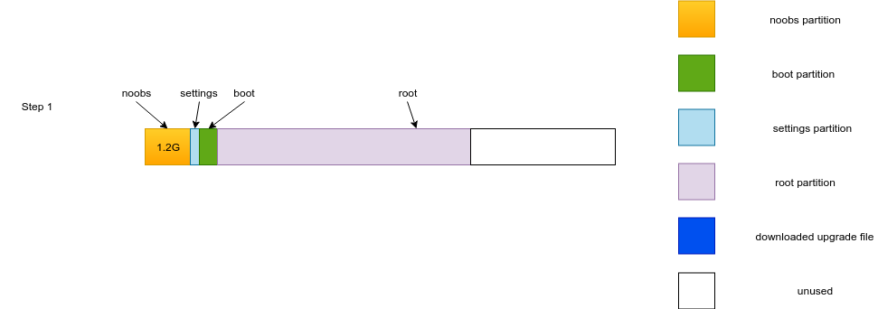
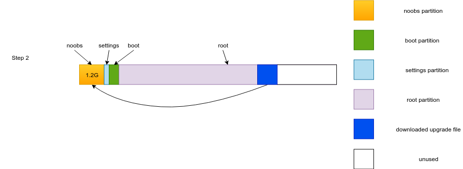
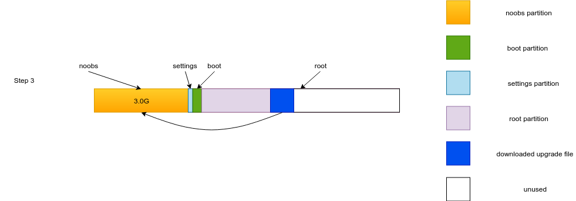
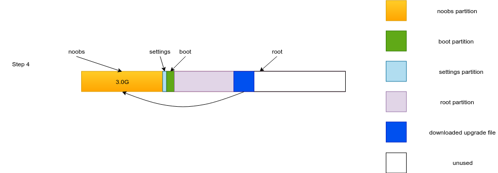

# 背景介绍

Yanshee-Raspi是Yanshee最初支持语音，图像及运动的软件．主要由robotagent, robotvoice, robotvision构成．

新的Yanshee-ROS是基于ROS(Robot operation system)开源框架的一套软件，同样包含了语音，图像及运动规划等功能．用户可以基于Yanshee-ROS开发基于ROS的包来提升Yanshee的能力．　Yanshee-ROS支持了RESTful API来控制机器人，用户可以自主选择熟悉的语言来控制机器人．

# 升级原理
当前树莓派由noobs安装，在sd卡的最开始位置有大概1.2G的分区是用来存放noobs文件．当用户需要把/boot分区或都/root分区回到原始状态的时候，可以启动noobs恢复．但是Yanshee-ROS对noobs的需求大概在3.0G左右，因为需要在系统启动的时候将noobs分区扩大．  

# 升级步骤
**在升级过程中请不要换网络，因为升级过程中需要下载安装包，如果无线网络改变．将会下载失败，只能把Yanshee拆开，[直接用SD卡升级](https://github.com/raspberrypi/noobs)**
1. 步骤１：  
升级到Yanshee-Raspi v1.3.4.5．然后Yanshee会提示有新版本，是否升级．请语音回答＂升级＂
这时候Yanshee文件系统分区如下：  

2. 步骤２：  
语音回答升级后，Yanshee会下载v1.5.0.1版本．然后将第一个分区（noobs分区)挂载到root分区上．并在校验下载文件的md5值后，开始安装文件到noobs分区．安装完成后系统分自动启动．  
这时候Yanshee文件系统分区如下：　　

3. 步骤３：  
启动重启后会直接进入noobs安装．noobs在安装新系统的时候会将noobs分区重新分成3.0G．然后系统启动后会提示正在升级，并下载新的v1.5.1.1版本.
这时候Yanshee文件系统分区如下：　　

4. 步骤４：  
在v1.5.１.1版本下载完成后，系统会再次安装新的系统到noobs分区，这时候noobs分区已经是3.0G．安装完成后，系统会再次进入noobs安装界面．  
这时候Yanshee文件系统分区如下：　　

